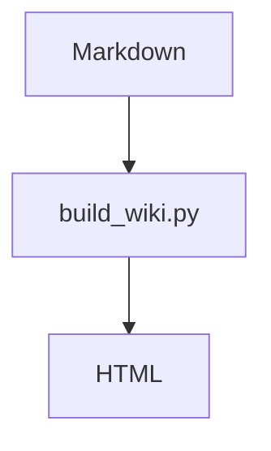

# ax-tutor

Claude Code 실습 위키를 정적 HTML로 생성하는 저장소입니다.

이 저장소의 페이지는 대부분 `docs/` 아래의 Markdown 문서를 원본으로 하고, `build_wiki.py`를 실행해서 루트의 `index.html`, `lab*/`, `help/`, `start/` 같은 HTML 페이지로 생성합니다.

## 핵심 구조

```text
axtutorial/
├── build_wiki.py        # Markdown -> 정적 HTML 생성 스크립트
├── nav.yml              # 사이드바/페이지 순서/빌드 대상의 단일 원천 소스
├── docs/                # 페이지 원본 Markdown
├── assets/              # 공통 CSS/JS
├── images/              # 문서에서 참조하는 이미지
├── materials/           # 강의 자료 및 다운로드 파일
├── index.html           # 손수 관리하는 홈 HTML, nav/toc만 빌드 시 동기화
└── types/index.html     # 손수 관리하는 정적 HTML, nav/toc만 빌드 시 동기화
```

## 페이지 생성 흐름

1. `docs/`에 Markdown 원본을 작성합니다.
2. `nav.yml`에 페이지를 등록합니다.
3. `python3 build_wiki.py`를 실행합니다.
4. `build_wiki.py`가 `docs/**/*.md`를 읽어 같은 경로의 `.html` 파일을 생성합니다.
5. 홈과 일부 정적 페이지의 사이드바/목차도 `nav.yml` 기준으로 다시 동기화됩니다.

예를 들어 `docs/lab1/step1.md`는 빌드 후 `lab1/step1.html`로 생성됩니다.

## nav.yml이 원천 소스입니다

`nav.yml`은 위키의 네비게이션과 생성 대상 페이지를 결정하는 단일 원천 소스입니다.

`nav.yml`의 리프 항목은 보통 이렇게 작성합니다.

```yaml
- { label: "1 · 한 표로 모으기", path: "lab1/step1.md" }
```

규칙은 다음과 같습니다.

- `group`: 사이드바에서 묶음 제목으로 표시됩니다.
- `children`: 그룹 아래의 페이지 또는 하위 그룹 목록입니다.
- `label`: 사이드바 표시명이며, 생성된 HTML의 `<h1>` 제목으로도 사용됩니다.
- `path`: `docs/` 기준 Markdown 경로입니다.
- `icon`: 선택 값이며 사이드바 링크 앞에 표시됩니다.

중요한 점:

- `path`에 해당하는 Markdown 파일이 `docs/` 안에 있으면 HTML 생성 대상이 됩니다.
- Markdown 파일이 없으면 빌드 대상에서는 제외되고, 정적 페이지 링크처럼 취급됩니다.
- 이전/다음 페이지 이동 순서도 `nav.yml` 순서를 따릅니다.
- 페이지 제목은 Markdown의 첫 `# 제목`보다 `nav.yml`의 `label`을 우선합니다.

## 새 페이지 추가 방법

새 페이지를 추가할 때는 Markdown 파일과 `nav.yml`을 함께 수정합니다.

```bash
mkdir -p docs/lab4
```

1. `docs/lab4/step1.md` 같은 Markdown 파일을 만듭니다.
2. `nav.yml`의 원하는 위치에 항목을 추가합니다.

```yaml
- group: "실습 4 · 새 실습"
  children:
    - { label: "개요", path: "lab4/index.md", icon: "◆" }
    - { label: "1 · 첫 단계", path: "lab4/step1.md" }
```

3. 빌드합니다.

```bash
python3 build_wiki.py
```

4. 생성된 HTML을 브라우저에서 확인합니다.

```bash
python3 -m http.server 8000
```

브라우저에서 `http://localhost:8000`을 열면 됩니다.

## 기존 페이지 수정 방법

HTML을 직접 고치기보다 `docs/`의 Markdown 원본을 수정한 뒤 다시 빌드합니다.

```bash
python3 build_wiki.py
```

빌드 스크립트가 다시 생성하는 HTML 파일은 산출물이므로, 본문 수정은 `docs/`에서 하는 것을 원칙으로 합니다.

예외적으로 `index.html`, `types/index.html`은 손수 만든 정적 페이지입니다. 이 두 파일은 본문 HTML을 직접 관리하지만, 빌드 시 `<nav>...</nav>` 블록과 우측 목차는 자동으로 동기화됩니다.

## 사용 가능한 Markdown 기능

`build_wiki.py`는 Python Markdown과 pymdown 확장을 사용합니다. 다음 기능을 사용할 수 있습니다.

- 표
- 목차 앵커
- 코드 하이라이트
- admonition/detail 블록
- 탭
- task list
- Mermaid 다이어그램

Mermaid는 Markdown에서 다음처럼 작성합니다.

````markdown

````

## 빌드 명령

일반 빌드:

```bash
python3 build_wiki.py
```

연결이 끊긴 오래된 HTML까지 정리:

```bash
python3 build_wiki.py --prune
```

`--prune`은 `nav.yml`에 등록되어 있지 않고 정적 페이지 목록에도 없는 HTML 파일을 삭제합니다. 의도하지 않은 수동 HTML이 지워질 수 있으니 실행 전 변경 사항을 확인하세요.

## Python 의존성

별도 requirements 파일은 없지만, 스크립트는 다음 패키지를 사용합니다.

```bash
python3 -m pip install markdown pymdown-extensions pyyaml
```

## 빌드 스크립트가 하는 일

`build_wiki.py`는 대략 다음 작업을 합니다.

- `nav.yml`을 읽어 사이드바 트리와 페이지 순서를 만듭니다.
- `docs/` 아래 Markdown 파일을 HTML로 변환합니다.
- 내부 `.md` 링크를 `.html` 링크로 바꿉니다.
- 현재 페이지 위치에 맞춰 `assets/` 상대 경로를 자동 계산합니다.
- Markdown 첫 `#` 제목을 제거하고 `nav.yml`의 `label`로 `<h1>`을 주입합니다.
- 이전/다음 페이지 pager를 자동 생성합니다.
- `index.html`, `types/index.html`의 nav/toc 블록을 동기화합니다.

## 작업 시 주의

- `nav.yml`을 먼저 보고 페이지 위치와 순서를 정합니다.
- 본문은 가능한 한 `docs/` Markdown에서 수정합니다.
- 빌드 산출물 HTML만 수정하면 다음 빌드 때 덮어써질 수 있습니다.
- `images/`와 `materials/`는 HTML 생성 대상이 아니라 정적 자원입니다.
- `docs/`에 파일이 있어도 `nav.yml`에 없으면 기본 빌드 대상에 포함되지 않습니다.
