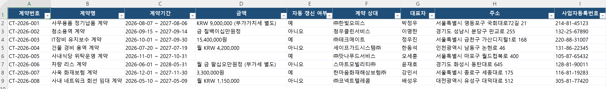
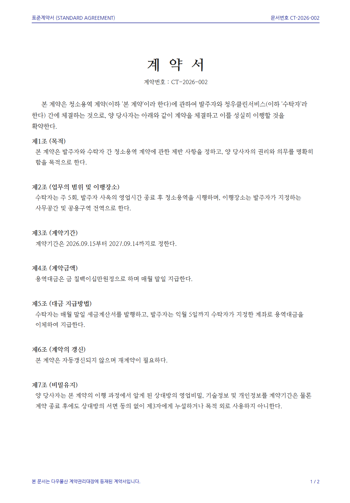
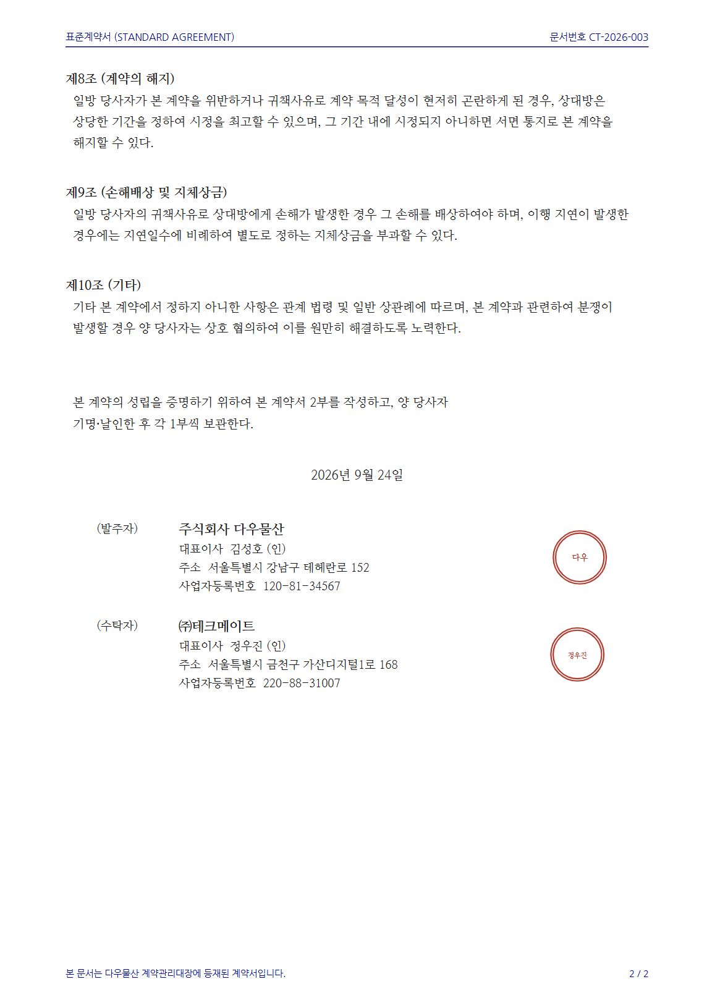

# 실습 페이지 작성 지침

이 문서는 `docs/labN/*.md` 실습 페이지를 쓸 때의 규칙입니다.
기준은 **lab2 = 따라야 할 모범**, **lab1 = 하지 말아야 할 반례** 입니다.

> 한 줄 원칙: **짧게, 구체적으로, 체크리스트로.**
> 학습자가 "무엇을 프롬프트에 담고, 무엇을 눈으로 확인하는지"만 남기고 나머지는 덜어냅니다.

---

## 0. 한눈에 보는 대조

| 항목 | ✅ lab2 (이렇게) | ❌ lab1 (이러지 않기) |
|---|---|---|
| step 분량 | 소스 30~40줄 | 소스 160줄 |
| 페이지 바꿈 `---` | 없음 | 섹션마다 `---` 남발 |
| 프롬프트 유도 | `✅ 담을 것 / ❌ 빼세요` 체크리스트 (모범답안은 필요 시) | 빈칸 채우기 + 모범답안 표 + 접기 다단계 |
| 이미지 | alt 텍스트 있는 실제 결과 화면 | 없음 |
| 접기(`???`) | 안 씀 | `question/tip/example` 3단 중첩 |
| 체크포인트 | `- [ ]` 3줄 | 있으나 장황한 설명에 파묻힘 |
| 톤 | 할 일과 확인만 | "아직 펼치지 마세요" 같은 메타 지시 과다 |

---

## 1. 페이지 골격

### index.md (실습 개요)

순서를 고정합니다.

1. `# 실습 N · 제목`
2. `> **한 줄 목표**: …` — 인용문 한 줄
3. `## 오늘 받은 일` — 사수 대사(인용문) + 짧은 설명 1문장
4. `## 폴더에 있는 것` — 파일 표 (+ 필요하면 예시 이미지)
5. `## 실습에서 할 일` — 단계 표 `[1단계](step1.md)` 링크

### stepN.md (각 단계)

순서를 고정합니다.

1. `# N단계 · 제목`
2. 무엇을 하는지 **1~2문장**
3. (필요 시) `## 뽑을 항목` 등 대상 명세 — 인용문
4. `## 직접 시켜보세요` — 학습자가 자기 문장으로 시킨다는 안내 1문장
5. `## 프롬프트에 꼭 담을 것 ✅` — 체크리스트
6. `## 이런 건 빼세요 ❌` — 체크리스트
7. `## 실행 예시` — `!!! example` + 이미지
8. `## 체크포인트` — `- [ ]` 체크리스트

---

## 2. 세부 규칙

### 2-1. 페이지 바꿈 `---` 을 넣지 않는다

- 마크다운 본문에 `---`(수평선)을 **쓰지 않습니다.**
- HTML 렌더링 시 **타이틀 아래에 구분선이 자동으로 들어갑니다.** 본문에 또 넣으면 선이 중복되고 페이지가 조각조각 끊겨 보입니다.
- 섹션 구분은 `---`가 아니라 **`##` 헤딩**으로 합니다.

```md
✅ lab2
## 프롬프트에 꼭 담을 것 ✅
...
## 이런 건 빼세요 ❌

❌ lab1
## 먼저 여러분 문장으로 시켜보세요
...
---
## 나온 것을 열어봅니다
---
```

### 2-2. step은 간결하게

- 한 step은 **하나의 작업 + 하나의 확인**만 담습니다.
- 빈칸 채우기(`<span class="blank-line">`), 모범답안 대조표, "5분 지나면 / 10분 지나면" 단계별 접기 같은 **장치를 겹쳐 쌓지 않습니다.** (lab1의 문제는 모범답안 자체가 아니라 이런 장치를 한 페이지에 다 얹은 것입니다.)
- 기본은 **담을 조건을 체크리스트로** 주는 것. 다만 필요하면 모범답안을 제시할 수 있습니다 → 다음 항목.

### 2-3. 프롬프트 작성 가이드는 ✅/❌ 체크리스트로

학습자 프롬프트를 직접 써주지 말고, **담아야 할 것 / 빼야 할 것**을 나눠 제시합니다.

```md
## 프롬프트에 꼭 담을 것 ✅

- [ ] **뽑을 항목** — 6개 그대로 (계약번호·계약명·…)
- [ ] **없는 값 처리** — 안 적힌 항목은 지어내지 말고 빈칸
- [ ] **결과 파일** — 하나의 엑셀 파일, 파일명 지정 (예: `계약종합.xlsx`)

## 이런 건 빼세요 ❌

- [ ] "알아서 잘 정리해줘"처럼 **규칙 없는 지시**
- [ ] 빈칸을 `0`으로 채우기
```

- 각 항목은 **한 줄**, 핵심 단어만 **볼드**.
- 왜 위험한지는 짧게 괄호로만: `(없는 값이 채워집니다)`.
- **가능하면 명사형으로.** "담을 것"은 결국 *프롬프트에 넣을 재료 목록*이니, "~할 것"보다 그 재료를 가리키는 **명사 라벨**을 앞세웁니다.
  "세 파일을 모두 읽어 합칠 것" → **읽을 대상** — 세 파일 전부 / "표준 7칸에 맞출 것" → **엑셀에 들어갈 칸** — 표준 7칸.
  (명사형이 어색한 항목은 동사형 그대로 둡니다.)

**파일명은 본문에선 뉴트럴하게, 프롬프트에선 명시**

- 본문 서술과 헤딩에는 특정 파일명을 박지 말고 **일반형**으로 씁니다.
  "표준 7칸 `주문종합`으로 합친다" ❌ → "표준 7칸짜리 **엑셀 한 장으로 합친다**" ✅.
  (실습이 가르치는 건 그 파일이 아니라 *합치는 일*입니다.)
- 대신 그 파일명은 **프롬프트 체크리스트 항목**으로 넘깁니다: `- [ ] 결과를 저장할 엑셀 파일명을 명시 (예: 주문종합.xlsx)`.
  파일명을 정해서 부르는 것 자체가 학습자가 챙겨야 할 기술입니다.
- 예외: **모범 프롬프트·체크포인트**는 구체적 파일명을 그대로 써도 됩니다(예시·검증 대상이라 명시가 자연스러움).

### 2-4. 모범답안은 "필요 시"만, 절제해서

모범답안을 완전히 배제하지는 않습니다. 학습자가 스스로 시켜본 **뒤에** 참고할 수 있게 제시합니다.

- **기본값은 없음.** 체크리스트로 충분하면 넣지 않습니다.
- 넣을 땐 **한 곳에 짧게**. lab1처럼 접기 + 대조표 + 완주 안내를 겹쳐 쌓지 않습니다.
- 제시 방식은 둘 중 하나:
  - **텍스트 프롬프트** — `## 실행 예시` 안이나 별도 접기 하나(`??? example "모범답안"`)에.
  - **예시 이미지 안** — 실행 예시 스크린샷에 프롬프트 문장이 함께 보이면 그것으로 갈음 가능.
- 위치는 학습자가 자기 문장을 먼저 시도한 **이후**가 되도록 배치합니다.

### 2-5. 구체적인 이미지를 넣는다

- 텍스트로 "이렇게 나옵니다"라고만 하지 말고 **실제 결과 화면 이미지**를 붙입니다.
- 위치는 `## 실행 예시` 아래 `!!! example` 안.
- 이미지는 `images/labN/` 에 두고 상대경로 `../images/labN/파일.png`.
- **alt 텍스트는 이미지 파일명 그대로** 씁니다(서술 X). 이미지가 아직 없을 때 브라우저에 파일명이 떠서, 작성자가 어떤 파일을 어디에 넣을지 바로 알아볼 수 있게 하기 위함입니다.
- 예시 이미지에는 결과 화면뿐 아니라 **모범 프롬프트 화면**이 들어가도 됩니다 (2-4 참고).

```md
## 실행 예시

!!! example "이렇게 나오면 됩니다"
    
```

- 개요에서 입력 자료를 보여줄 땐 나란히 배치도 가능(alt는 마찬가지로 파일명):

```md
<div style="display:flex;gap:12px;flex-wrap:wrap">
  
  
</div>
```

### 2-6. 체크포인트를 넣는다

- 모든 step은 `## 체크포인트`로 끝냅니다.
- `- [ ]` 항목 **2~4개**, 각 줄은 **눈으로 검증 가능한 사실**.
- "정상이면 이렇다"를 학습자가 직접 대조하게 만드는 게 목적입니다.

```md
## 체크포인트

- [ ] 계약종합이 **8행**(계약 8건)으로 나왔다
- [ ] **금액이 없는 계약이 빈칸**으로 남아 있다 (0이 아님)
- [ ] 6개 항목이 모두 채워졌고, 없는 값을 지어내지 않았다
```

### 2-7. 어드모니션은 절제해서

- 쓰는 것: `!!! example`(실행 예시), 필요 시 `!!! info`/`!!! success`, 모범답안용 접기 `??? example` 하나.
- **피하는 것**: `??? question/tip/example` 접기 **다단계 중첩**, 빈칸 채우기 블록, 수동 `<div class="stage-nav">` (이전/다음 네비게이션은 자동 생성됨).

---

## 3. 복붙용 템플릿

### index.md

```md
# 실습 N · 제목

> **한 줄 목표**: (무엇을, 어떤 제약으로 만드는지 한 문장)

## 오늘 받은 일

> 상황 한 줄. 사수가 말합니다.
>
> "업무 지시 대사. 반드시 포함할 것과 하지 말 것을 자연스럽게."

(맡기고 → 검증까지 한다는 방향 1문장)

## 폴더에 있는 것

| 파일 | 무엇 |
|---|---|
| `파일명` | 설명 |

## 실습에서 할 일

| 단계 | 할 일 |
|---|---|
| [1단계](step1.md) | … |
| [2단계](step2.md) | … |
```

### stepN.md

```md
# N단계 · 제목

(이 단계에서 하는 일 1~2문장)

## 직접 시켜보세요

여러분 문장으로 AI에게 시킵니다. 아래 두 체크리스트를 먼저 읽고 빠진 규칙이 없도록 담으세요.

## 프롬프트에 꼭 담을 것 ✅

- [ ] **명사 라벨** — 구체 내용
- [ ] **명사 라벨** — 구체 내용

## 이런 건 빼세요 ❌

- [ ] …
- [ ] …

## 실행 예시

!!! example "이렇게 나오면 됩니다"
    

## 체크포인트

- [ ] …
- [ ] …
```

---

## 4. 마무리 — 이미지 폴더와 목록

lab을 다 쓰면 두 가지로 마무리합니다.

1. **이미지 폴더를 미리 만든다** — `images/labN/` 를 생성해 둡니다(비어 있어도 됨).
   페이지는 이미지가 없어도 정상 동작하고, 나중에 파일만 넣으면 자동 반영됩니다.
2. **추가할 이미지 목록을 표로 출력한다** — 작성자가 나중에 채울 수 있도록, 어떤 이미지를 어떤 파일명으로 어디에 넣을지 **마지막에 표로 정리해서** 보여줍니다.

| 파일명 | 들어갈 곳 | 무엇을 담나 |
|---|---|---|
| `images/labN/stepM-result.png` | stepM 실행 예시 | (결과 화면 서술) |
| `images/labN/xxx_example.png` | index 개요 | (입력 자료 서술) |

- 표의 파일명은 페이지의 이미지 경로·`alt`와 **정확히 일치**해야 합니다(불일치 시 깨진 이미지).
- "무엇을 담나"는 작성자가 이미지를 준비할 때 참고할 설명이니 구체적으로 씁니다(페이지 `alt`는 파일명만).

---

## 5. 제출 전 점검

- [ ] 본문에 `---`(수평선)이 없다
- [ ] step 소스가 대략 40줄 이내로 간결하다
- [ ] `프롬프트에 담을 것 ✅` / `빼세요 ❌` 체크리스트가 있다
- [ ] 본문·헤딩은 파일명을 박지 않고 뉴트럴하게, 파일명은 프롬프트 체크리스트로 명시했다
- [ ] `실행 예시`에 실제 이미지 + 서술형 alt 텍스트가 있다
- [ ] `체크포인트`가 눈으로 검증 가능한 `- [ ]` 항목으로 끝난다
- [ ] 모범답안을 넣었다면 학습자가 먼저 시도한 뒤 위치이고, 접기/이미지 하나로 짧게 처리했다
- [ ] `???` 다단계 중첩, 빈칸 채우기, 수동 네비게이션을 쓰지 않았다
- [ ] `images/labN/` 폴더를 만들었고, 추가할 이미지 목록을 표로 정리했다
